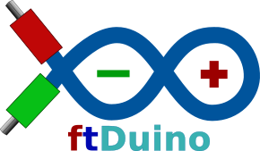
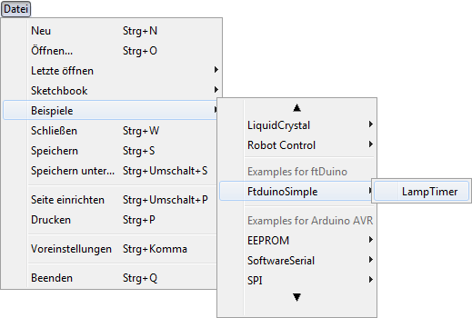

Hier geht es zur [deutschsprachigen Anleitung](https://github.com/harbaum/ftduino/raw/master/manual.pdf).

Lust auf einen eigenen ftDuino? Einfach eine Email an info@ftduino.de  schicken und die Verfügbarkeit erfragen.

# ftDuino

The ftDuino is an [arduino](http://arduino.cc) compatible controller for the
[fischertechnik construction toy](http://fischertechnik.de).

The ftDuino is similar to the fischertechnik TXT in size and shape as
well as electrically and can usually be used as a drop-in-replacement
to this controller.

The ftDuino combines the sophisticated mechanics of the fischertechnik
toy with the versatility of the arduino world allowing anyone to create
and program awsome robots.

## Features of the ftDuino

   - mechanically and electrically compatible to the fischertechnik TXT
     - 8 universal analog inputs I1 to I8
     - 4 fast counter inputs C1 to C4
     - 8 analog outputs O1 to O8 which can be combined as motor outputs M1 to M4
     - supports all fischertechik sensors and actors
       - motors
       - buttons and switches
       - temperature and optical sensors
       - line, distance and and orientation sensors
       - much much more ...
   - I²C connector
     - fischertechnik TX compatible
     - master/slave capable
   - compatible to standard fischertechnik 9V power supply
     - 9V Battery pack
     - 8.4V accu pack
     - 9V power set
   - compatible with Arduino IDE
     - Custom libraries
     - Lots of examples

## Videos

See the ftDuino in action on [youtube](https://www.youtube.com/playlist?list=PLi6a2BPpYcCTMfehFcKaVUSZGubVMpxHx).

## About this repository

This repository contains support files to enable ftDuino support in
the Arduino IDE.

## Installation

You can easily add custom board support packages to the Arduino IDE
as described e.g. [here](https://learn.adafruit.com/add-boards-arduino-v164/overview).

You first need to add the download location of the ftDuino setup to
the preferences of the Arduino IDE:

Afterwards the ftDuino will show up in the board manager from where
it can be installed by just one click:

Afterwards the ftDuino can be selected as the current device and
e.g. the ftDuino code examples will automatically show up in the
file menu:

The ftDuino is now supported by the Arduino IDE and can be used
without any further setup.
