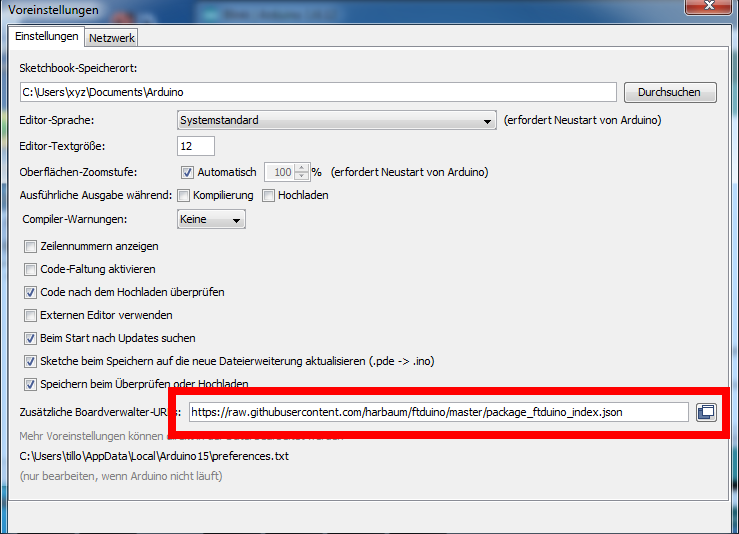

# ftDuino

  

## Der ftDuino

[English version below](https://github.com/harbaum/ftduino#the-ftduino)

Der ftDuino schlägt die Brücke zwischen den populären
[Arduino](http://arduino.cc)-Controllern und dem leistungsfähigen
[fischertechnik](http://fischertechnik.de)-Konstruktionsspielzeug.

  

### ftDuino kaufen

Haben wir Lust auf einen eigenen ftDuino gemacht? Es gibt ihn jetzt
als fertiges Gerät zu kaufen. Einfach eine Email an info@ftduino.de
schicken und die Verfügbarkeit und den Preis erfragen.

### Was ist der ftDuino?

Der ftDuino eignet sich für Programmier-Anfänger, die einen ersten
Blick in die "ernste" Programmierung werfen und ihre
fischertechnik-Modelle professionell steuern wollen. Er eignet sich
aber ebenso für erfahrene Arduino-User, die das leistungsfähige
fischertechnik-System für komplexe mechanische Modelle nutzen wollen.

Der ftDuino kombiniert auf perfekte Weise die Vorteile des
Arduino-Systems mit den Fähigkeiten des fischertechnik-Systems.

Der ftDuino erfordert als Fertiggerät kein Löten und mit dem
fischertechnik-System ist auch der mechanische Aufbau ein Kinderspiel.

### Anleitung

Der ftDuino kommt mit einer über hundertseitigen [deutschsprachigen
Anleitung](https://harbaum.github.io/ftduino/manual.pdf). Die
Anleitung erklärt alle Schritte von der Einrichtung der Arduino-IDE
über die ersten eigenen Programme bis zu forgeschrittener
Programmierung.

Alle Source-Codes und Unterlagen zum ftDuino finden sich im
[Github-Repository](https://github.com/harbaum/ftduino) zum freien
Download.

### Eigenschaften des ftDuino

   - mechanisch und elektrisch kompatibel zum fischertechnik TXT
     - 8 universtelle Analogeingänge I1 bis I8
     - 4 schnelle Zählereingänge C1 bis C4
     - 8 analoge Ausgänge O1 bis O8, die zu Motorausgängen M1 bis M4 kombiniert werden können
     - unterstützt alle fischertechnik-Aktoren und -Sensoren
       - Motoren
       - Schalter und Taster
       - Temperatur- und optische Sensoren
       - Linien-, Distanze- und Orientierungssensoren
       - vieles mehr ...
   - I²C-Ascnhluss
     - fischertechnik-TX-kompatibel
     - Master/Slave-fähig
   - kompatibel mit üblichen fischertechnik-9V-Versorgungen
     - 9V Batterie-Halter
     - 8.4V-Akku-Pack
     - 9V-Power-Set-Netzteil
   - voll kompatibel mit der Arduino-IDE
     - speziell angepasste Bibliotheken
     - viele Beispiele

## The ftDuino

The ftDuino is an [arduino](http://arduino.cc) compatible controller for the
[fischertechnik construction toy](http://fischertechnik.de).

The ftDuino is similar to the fischertechnik TXT in size and shape as
well as electrically and can usually be used as a drop-in-replacement
to this controller.

The ftDuino combines the sophisticated mechanics of the fischertechnik
toy with the versatility of the arduino world allowing anyone to create
and program awsome robots.

### Features of the ftDuino

   - mechanically and electrically compatible to the fischertechnik TXT
     - 8 universal analog inputs I1 to I8
     - 4 fast counter inputs C1 to C4
     - 8 analog outputs O1 to O8 which can be combined as motor outputs M1 to M4
     - supports all fischertechik sensors and actors
       - motors
       - buttons and switches
       - temperature and optical sensors
       - line, distance and and orientation sensors
       - much much more ...
   - I²C connector
     - fischertechnik TX compatible
     - master/slave capable
   - compatible to standard fischertechnik 9V power supply
     - 9V Battery pack
     - 8.4V accu pack
     - 9V power set
   - compatible with Arduino IDE
     - Custom libraries
     - Lots of examples

### Videos

See the ftDuino in action on [youtube](https://www.youtube.com/playlist?list=PLi6a2BPpYcCTMfehFcKaVUSZGubVMpxHx).

### About this repository

This repository contains support files to enable ftDuino support in
the Arduino IDE.

### Installation

You can easily add custom board support packages to the Arduino IDE
as described e.g. [here](https://learn.adafruit.com/add-boards-arduino-v164/overview).

You first need to add the download location of the ftDuino setup to
the preferences of the Arduino IDE:

Afterwards the ftDuino will show up in the board manager from where
it can be installed by just one click:

Afterwards the ftDuino can be selected as the current device and
e.g. the ftDuino code examples will automatically show up in the
file menu:

The ftDuino is now supported by the Arduino IDE and can be used
without any further setup.
